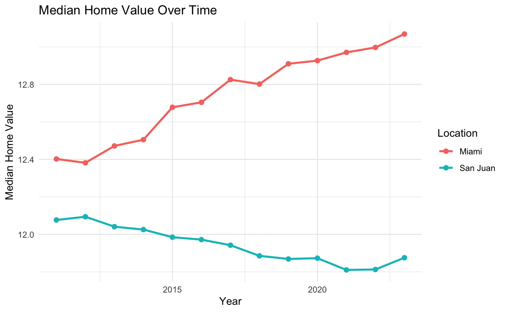

# SeniorProj-ECON464
## Overview
This repository contains the files related to my senior project research paper for the Economics major at Cal Poly SLO. This project investigates how hurriances impact housing markets in the San Juan Metropolitan Area (SJMA)

I employ a difference-in-differences (DiD) framework to isloate the casual effect of Hurricanes Irma and Maria (2017) on housing prices in San Juan, PR by comparing this outcome variables in Miami, FL before and after the 2017 storms. By implemented two forms of the model (with and without fized effects), the analysis disentangles storm-driven impacts on housing prcies from broader economic factors.
## Research Question
Do hurricanes causally increase housing demand and prices in Puerto Rico, or do observed changes reflect other local economic factors?

## Data
Puerto Rico Community Survey (PRCS) and American Community Survey (ACS) data accessed through IPUMS.  
Years covered: 2011–2023.  
Variables include:  
• HHINCOME (household income)  
• ROOMS (housing unit size)  
• EMPSTAT (employment status)  
• Home Value (logged and inflation-adjusted to 2023 USD)  
• post (binary indicator, 1 = after 2017, 0 = 2017 or earlier)  
• treatment (binary indicator, 1 = impacted by Hurricanes Irma and Maria a.k.a. in San Juan, PR, 0 = unimpacted by Hurricanes Irma and Maria a.k.a. in Miami, FL)

Data cleaning in this project includes:
1. Recoding categorical variables on the basis of the IPUMS code book to prepare an appropriate format for our analysis (e.g., household income, employment status, etc.)  
2. Adjusting the home value variable for inflation (base year = 1999 in IPUMS) and logging to stabilize variance in observations  
3. Defining requisite pre/post and treatment/control groups for DiD modeling

## Modeling Methodology
• Implement DiD model without fixed effects  
• Apply household weights from IPUMS for representativeness  
• Run model with fixed effects to control for cyclical shocks

## Key Results
• Without year fixed effects: SJMA homes depreciated ~34.55% more than those in Miami  
• With year fixed effects: SJMA homes depreciated ~49.81% more than those in Miami  
• Conclusion: Hurricanes Irma and Maria had a causal negative effect on housing prices in Puerto Rico, despite observed short-run increases, contrasting with the classical theory suggesting that supply shocks raise prices  

## Limitations
• The study lacks a suitable counterfactual to the SJMA, comprimising the validity of my findings. A suitable counterfactual in this context should possess similar economic and geographical qualities to the SJMA, but must remain uneffected by the hurricanes. This was determined to be Miami in the study, however Miami fails the parallel trends test, meaning the the trends in housing prices in the respective samples were not similar enough prior to the hurricanes for the model to be able to adequately isolate their effect on housing prices. This is visualized in the plot below.  
• While IPUMS provides a CPI index to adjust for inflation, public data was not available for local price indexes which could be used to strengthen the accuracy of my findings  

## Code Features
• R (RMarkdown, tidyverse, knitr)  
• Difference-in-Differences regression (lm(), feols() in R)  
• kable() output formatting for tables  
